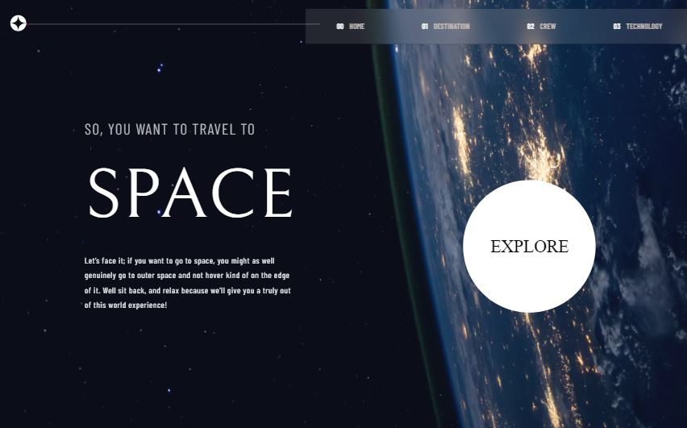
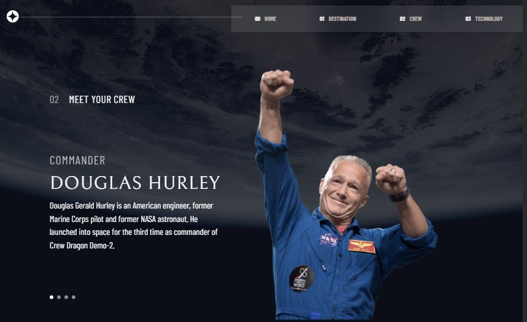
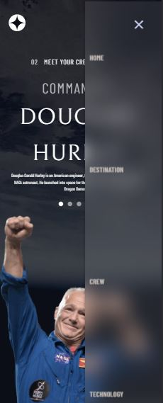
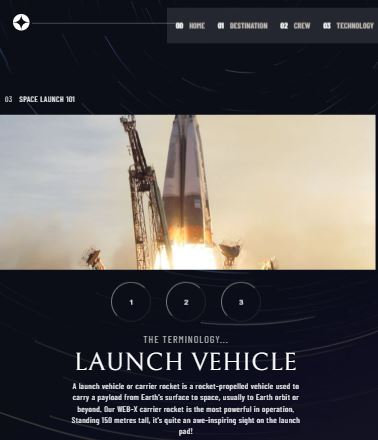

# Frontend Mentor - Space tourism website solution

This is a solution to the [Space tourism website challenge on Frontend Mentor](https://www.frontendmentor.io/challenges/space-tourism-multipage-website-gRWj1URZ3). Frontend Mentor challenges help you improve your coding skills by building realistic projects. 

## Table of contents

- [Overview](#overview)
  - [The challenge](#the-challenge)
  - [Screenshot](#screenshot)
  - [Links](#links)
- [My process](#my-process)
  - [Built with](#built-with)
  - [What I learned](#what-i-learned)
  - [Continued development](#continued-development)
  - [Useful resources](#useful-resources)
- [Author](#author)
- [Acknowledgments](#acknowledgments)


## Overview

### The challenge

Users should be able to:

- View the optimal layout for each of the website's pages depending on their device's screen size
- See hover states for all interactive elements on the page
- View each page and be able to toggle between the tabs to see new information

### Screenshot







### Links

- Solution URL: [Add solution URL here](https://your-solution-url.com)


## My process

Firstly, I selected the Upper Intermediate project for advance then I created this project file. I set up semantic HTML and upon writing CSS, tried to develop the right way step by step. Furthermore, I notched my HTML page with CSS and JS so that I set up a flexible menu. I created multiple pages with a connection that each other like a Figma project.Accomplishing in the way There takes place "carousel js" that goes to pages in point.

### Built with

- Semantic HTML5 markup
- CSS custom properties
- Flexbox
- CSS Grid
- Mobile-first workflow
- Javascript


### What I learned

I set to it multiple pages with carousel js. Shortly I did make benefit hidden features in css instead of plenty of multiple HTML and Css pages with JS.

```html
<article id="moon-tab" tabindex="0" role="tabpanel">
  <h2 class="fs-800 moon-title">Moon</h2>
  <p class="fs-200 font-moon--text ff-barrow">See our planet as you’ve never seen it before. A perfect relaxing trip away to help regain perspective and come back refreshed. While you’re there, take in some history by visiting the Luna 2 and Apollo 11 landing sites.
  </p>

  <div class="card-subtime flex fs-400 ff-sans-cond letter-spacing-2">
  <div class="card-subheading">Avg. distance
  <h3 class="card-heading1 fx-28">384,400 km</h3>
  </div>
  <div class="card-subheading">Est. travel time
  <h3 class="card-heading2 fx-28">3 days</h3>
  </div>
  </div>
 </article>
```
```css
[hidden] {
  display: none;
}
```
```js
function hideContent(parent, content){
  parent
  .querySelectorAll(content)
  .forEach((item) => item.setAttribute("hidden", true));

}

function showContent(parent, content){
  parent.querySelector(content).removeAttribute('hidden');

}
```


### Continued development

I want to try "geolocation js", javascript, UI, and grid system in the future on the level phase.

### Useful resources

- [Example resource 1](https://scrimba.com/) - This helped me with the scrimba.com website on outline reason. 


## Author

- Website - [Özgür Çelik](https://ozgurcelik.hashnode.dev/)
- Frontend Mentor - [@yourusername](https://www.frontendmentor.io/profile/ozgurcc1)
- Github - [@ozgurcelix](https://github.com/ozgurcelix)


